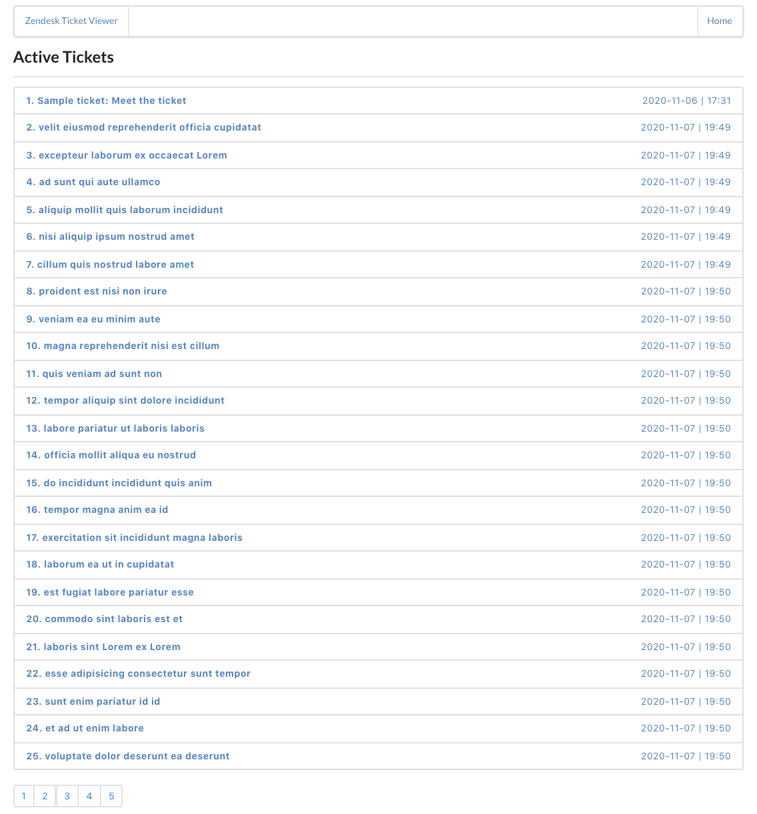
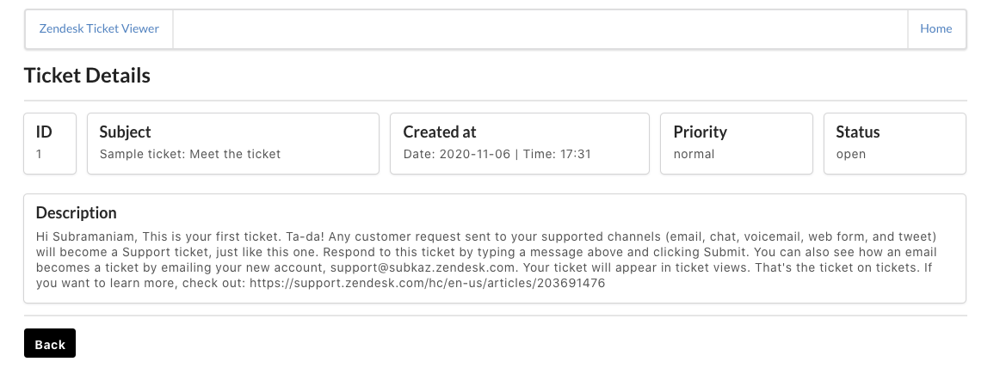

# Zendesk Coding Challenge

A web-based ticket viewer for Zendesk's Intern Coding Challenge. 

Tech Stack :

- ```Node.js``` + ```Express.js```
- ```React```
- ```Jest``` + ```Enzyme``` 


*Fig 1. Home Page*


*Fig 2. Ticket Details Page*

## Prerequisites

- Install ```node.js``` from their [website](https://nodejs.org/en/).
- ```npm``` was the node package manager of choice for this assignment.

## Installation

Clone the project

```bash
git clone https://github.com/subu-nair1798/zendesk-challenge.git
```

Move into the directory

```bash
cd zendesk-challenge
```

Install server-side dependencies

```bash
npm install
```

Move into the client directory

```bash
cd client
```

Install client-side dependencies

```bash
npm install
```

## Deployment 

Go to the root directory i.e. *zendesk-challenge* and run :

```bash
npm run dev
```

```concurrently``` simultaneously runs a server-side and client-side script.

## Tests

Go to the root directory i.e. *zendesk-challenge* and run :

```bash
npm run test
```
# Task-wise Breakdown

### Task 1

The application in its entirety is the response to Task 1.

### Task 2

As a response to Task 2, I have created an intuitive UI using React. The naming and directory structure of class components, functional components and all the other elements of the application conform to the commonly accepted naming convention.Additionally, I have attached a duplicate copy of the ```README.md``` file that guides you through the entire project.

### Task 3

As a response to this task, the tech stack used and structure of all components in this submission ensures extensibility and Separation of Concerns (SoC). By keeping the client-side and server-side separate, the application facilitates extensibility and adaptibility. We can easily modify either or both components and use different frameworks / technologies if required. Moreover, using an in-use and regularly updated tech stack in conjunction with ```Babel``` for transpiling the code, the application also ensures longetivity and backwards compatibility. Further, the structure of the client side displays Separation of Concerns. The entry-point of the application i.e. ```App.js``` contains routing for various pages and error handling for bad paths. The **_pages_** sub-directory contains the pages corresponding to the url paths. The **_components_** sub-directory contains the ```React JSX``` components which are used by the respective pages. A structured application design like this will easily incorporate any additions / deletions to the application.

### Task 4

As a response to Task 4, the code for ```Pagination``` displays simplicity, readability and extensibility which also makes it easy to test. 

### Task 5

As a response to Task 5, I have implemented a current and in-use React testing framework ```Jest``` in conjunction with ```Enzyme```. Further, the directory structure ensures ease of navigation for adding / removing tests.

### Task 6

In an event where there is a significant increase in the amount of data, there are two approaches that come to my mind to tackle the same.

1. The first approach is that the server can fetch the entire ticket json from the zendesk api and render the required amount of tickets-per-page only on page click of the pagination i.e. for Page 2, the React component will only render the ticket list JSX for indices 25 - 49 and subsequently render other pages only on click. This will avoid a long rendering time which would have been the case had the entire ticket list json was rendered altogether in one go.   

2. The second approach is that the server can make repeated API calls to the zendesk server to fetch only the required amount of tickets for that specific page. Since by default, the endpoint ```GET /api/v2/tickets.json``` returns 100 tickets per page which will render 4 paginated pages, we can add an arrow button to render the next 4 pages i.e. 5, 6, 7, 8 and increment the pages value in the query string from ```GET /api/v2/tickets.json?page=1``` to ```GET /api/v2/tickets.json?page=2``` and accordingly fetch and render subsequent tickets.

I have implemented the former since the sample size for this assignment was of 100 tickets. The latter can also be implemented provided that the user has a stable internet connection and the cost of making API requests at every button click is not high.

### Task 7

Using Promise-based HTTP clients, like ```axios``` for the server-side and ```fetch API``` for the client-side, streamlined the process of error handling in case of request / response errors. Further, the use of ```react-router-dom``` elegantly handled bad paths by displaying friendly error messages and also guiding the user back to safe paths. Additionally, in the React components, I have added state flags and variables (e.g. errorFlag and errorMessage) that work in conjunction with the aforementioned error handling code to display the sais messages.


